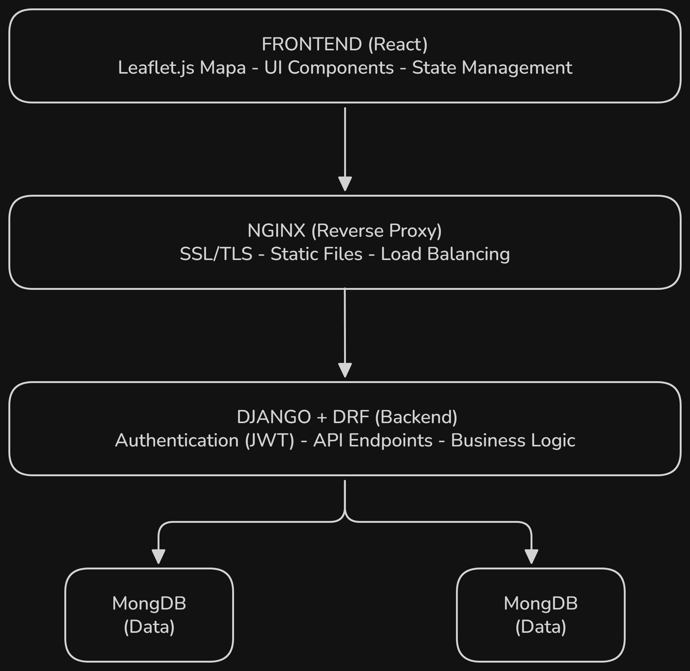

# Technology Decision Document (TDD)
## Projekt: Aplikacja do Planowania Tras Spacerowych

**Autorzy:** Paweł Hebda, Stanisław Sikorski, Adam Czupryński, Ola Samsel, Wiktor Sosnowski  
**Wersja:** 1.0  
**Data:** Kwiecień 2026  
**Status:** Do zatwierdzenia  

---

## 1. Executive Summary

Niniejszy dokument opisuje decyzje techniczne podjęte dla projektu **APSI-3** - aplikacji webowej do planowania tras spacerowych w Warszawie. Dokument zawiera uzasadnienie każdego wyboru technologicznego oraz porównanie z alternatywami.

**Kluczowe wymagania projektu:**
- Responsywna aplikacja webowa (mobile-first)
- Integracja z mapą Warszawy i danymi publicznymi
- Zarządzanie kontami użytkowników
- Optymalizacja tras spacerowych na podstawie preferencji użytkownika
- Zapisywanie i statystyki spacerów

---

## 2. Stack Technologiczny

### 2.1 Frontend

| Komponent | Technologia | Wersja |
|-----------|-------------|--------|
| **Framework** | React | 18+ |
| **Bundler** | Vite / Create React App | Najnowsza |
| **Mapowanie** | Leaflet.js + React-Leaflet | 4.x |
| **HTTP Client** | Axios lub Fetch API | - |
| **State Management** | Context API / Zustand | - |
| **Styling** | Tailwind CSS / CSS Modules | - |
| **Testing** | Jest + React Testing Library | - |

### 2.2 Backend

| Komponent | Technologia | Wersja |
|-----------|-------------|--------|
| **Framework** | Django | 4.2+ |
| **API** | Django REST Framework (DRF) | 3.14+ |
| **Database** | MongoDB | 5.0+ |
| **ODM/ORM** | MongoEngine | 0.24+ |
| **Authentication** | djangorestframework-simplejwt | 5.x |
| **Caching** | Redis | 7.0+ |
| **Task Queue** | Celery (opcjonalnie) | 5.x |

### 2.3 Infrastructure & DevOps

| Komponent | Technologia | Uzasadnienie |
|-----------|-------------|--------------|
| **Web Server** | Nginx | Reverse proxy, High Performance |
| **Containerization** | Docker | Konsistencja środowiska (dev/prod) |
| **Orchestration** | Docker Compose (dev) | Łatwe konfigurowanie lokalnie |
| **Hosting** | Azure (opcjonalnie) | Plan na przyszłość, zgodnie z dokumentacją |
| **Package Manager** | pip (backend), npm (frontend) | Standardy branży |

### 2.4 Zewnętrzne API

| Usługa | Cel | URL |
|--------|-----|-----|
| **Leaflet.js** | Wyświetlanie mapy | https://leafletjs.com |
| **Warszawskie API OpenData** | Dane o terenach zielonych | https://api.um.warszawa.pl |
| **WMS Warszawa** | Dane o oświetleniu, hałasie | https://wms.um.warszawa.pl |

---

## 3. Uzasadnienie Wyborów Technicznych

### 3.1 Frontend: React

#### Powody wyboru:
1. Duża społeczność - bogaty ekosystem bibliotek, łatwo znaleźć rozwiązania
2. Komponenty reużywalne - idealne dla dynamicznej interfejsu mapy
3. Nowoczesny tooling - Vite, Create React App, doskonałe narzędzia developerskie
4. Mobile-friendly - React Native można wykorzystać w przyszłości
5. Deklaratywny - kod jest bardziej czytelny i łatwiejszy do debugowania
6. State management - Context API lub Zustand dla prostych aplikacji
7. Doświadczenie zespołu - członkowie zespołu znają React (Adam)

---

### 3.2 Backend: Python + Django

#### Powody wyboru:
1. Szybkość development - Django ma wiele wbudowanych funkcji (admin, ORM, authentication)
2. Bezpieczeństwo - wbudowana ochrona przed CSRF, SQL injection, XSS
3. Django REST Framework - doskonała biblioteka do tworzenia API
4. Dokumentacja - jedna z najlepszych w branży
5. Doświadczenie zespołu - zespół ma doświadczenie w Pythonie
6. Skalowanie - Django dobrze skaluje się dla aplikacji tego rozmiaru
7. Ekosystem - biblioteki do integracji z mapami, GIS (Django-GIS)

---

### 3.3 Baza Danych: MongoDB

#### Powody wyboru:
1. Dane niestrukturalne - preferencje użytkownika mogą być różnorodne
2. Skalowanie horyzontalne - łatwe shardowanie dla przyszłości
3. Elastyczność - schemat dokumentów można zmieniać bez migracji
4. JSON-native - naturalne mapowanie do API JSON
5. Wydajność - szybkie zapytania dla geograficznych danych (geospatial queries)
6. Integracja - MongoEngine ułatwia pracę z Djangiem

---

### 3.4 Uwierzytelnianie: JWT (JSON Web Tokens)

#### Powody wyboru:
1. Stateless - serwer nie musi przechowywać sesji
2. Skalowanie - łatwe w środowisku mikroserwisów
3. Mobile-friendly - naturalnie wspierany przez aplikacje mobilne
4. Bezpieczny - token jest podpisany (niemożliwy do fałszowania)
5. Prosty w implementacji - `djangorestframework-simplejwt`
6. Standard branżowy - stosowany przez większość nowoczesnych aplikacji

#### Schemat bezpieczeństwa:
```
1. Użytkownik loguje się (email + password)
2. Serwer weryfikuje i wydaje JWT (access + refresh token)
3. Frontend przechowuje w localStorage/sessionStorage
4. Każde żądanie zawiera: Authorization: Bearer <token>
5. Serwer weryfikuje podpis tokenu
6. Token wygasa po 15-60 minut (refresh token na 7 dni)
```

---

### 3.5 Web Server: Nginx

#### Powody wyboru:
1. Wysoka wydajność - obsługuje miliony połączeń
2. Reverse proxy - idealne do load balancingu
3. Static files - szybkie serwowanie assetsów React
4. Compression - gzip, brotli dla mniejszych rozmiarów
5. Lekki - mniej zasobów niż Apache

---

### 3.6 Containerization: Docker

#### Powody wyboru:
1. Konsystencja - dev, staging, prod to to samo środowisko
2. Ułatwia wdrażanie - CI/CD pipelines, łatwe rollbacki
3. Skalowanie - łatwe spinowanie nowych instancji
4. Izolacja - bez konfliktów zależności

#### Struktura:
```
project/
├── docker-compose.yml (dev environment)
├── backend/
│   ├── Dockerfile
│   ├── requirements.txt
│   └── ...
├── frontend/
│   ├── Dockerfile
│   └── ...
└── nginx/
    ├── Dockerfile
    └── nginx.conf
```

---

## 4. Architektura Systemu



---

## 5. Wymagania Techniczne dla Zespołu

### 5.1 Obowiązkowe (Must-have)
- Python 3.10+ (backend)
- JavaScript/TypeScript (frontend)
- Git & GitHub (version control)
- Docker (containerization)
- REST API koncepty

### 5.2 Zalecane (Nice-to-have)
- Django framework
- React framework
- MongoDB basics
- JWT authentication
- Docker Compose

### 5.3 Narzędzia deweloperskie
```bash
# Backend
pip install django djangorestframework djangorestframework-simplejwt mongoengine

# Frontend
npm install react react-dom leaflet react-leaflet axios zustand

# Development
npm install --save-dev tailwindcss
pip install black flake8 pytest
```

---

## 6. Harmonogram Implementacji

Lista rzeczy do wykonania (kolejność zgodnie z zależnościami):

- [ ] Konfiguracja Django projektu + DRF
- [ ] Setup React + Vite
- [ ] Docker setup (dev environment)
- [ ] MongoDB + Docker Compose
- [ ] Nginx configuration
- [ ] Git repository setup
- [ ] User model w Django
- [ ] JWT authentication (SimpleJWT)
- [ ] Registration endpoint
- [ ] Login endpoint
- [ ] Frontend login/register forms (React)
- [ ] Token storage & refresh logic
- [ ] Leaflet.js integration (React-Leaflet)
- [ ] Mapa Warszawy + API integracja
- [ ] Point selection UI
- [ ] Route calculation algorithm (backend)
- [ ] Route display na mapie
- [ ] Preferences endpoint
- [ ] Start/stop walk endpoints
- [ ] Real-time location tracking (optional)
- [ ] Walk history storage
- [ ] Walk replay functionality
- [ ] Statistics calculation
- [ ] Responsive design (mobile-first)
- [ ] User dashboard
- [ ] Walk history UI
- [ ] Statistics display
- [ ] Preferences management UI
- [ ] Unit tests (pytest, Jest)
- [ ] Integration tests
- [ ] E2E tests (Cypress/Playwright)
- [ ] Performance optimization
- [ ] Azure deployment setup

---

## 7. Security Considerations

Wybór JWT zamiast sesji tradycyjnych jest uzasadniony wymogiem responsywności aplikacji i możliwością rozszerzenia systemu na platformy mobilne w przyszłości. JWT umożliwia bezstanową autentykację, która jest kluczowa dla skalowalności i niezawodności systemu rozproszonego.

### Proaktywne kroki:
- HTTPS only (SSL/TLS)
- JWT signing with strong secrets
- CORS konfiguracja
- Rate limiting na endpoints
- Input validation & sanitization
- Password hashing (bcrypt/argon2)
- Dependency scanning (Dependabot)

### Django Security
```python
# settings.py
SECURE_SSL_REDIRECT = True
SESSION_COOKIE_SECURE = True
CSRF_COOKIE_SECURE = True
ALLOWED_HOSTS = ['api.domain.com']
SECRET_KEY = os.environ.get('SECRET_KEY')  # Never hardcode!
```

---

## 8. Metryki Monitorowania

- API Response Time (< 200ms)
- Error Rate (< 0.1%)
- Database Query Time (< 100ms)
- User Concurrent Sessions
- Uptime (target: 99.5%)

---

## 9. Zatwierdzenia

Do podjęcia decyzji i zatwierdzenia przez:

- Paweł Hebda (Project Manager)
- Stanisław Sikorski (Backend Lead)
- Adam Czupryński (Frontend Lead)
- Ola Samsel (UX)
- Wiktor Sosnowski (Full Stack)

---

## 10. Appendix: Przydatne Zasoby

### Dokumentacja
- [Django Official Docs](https://docs.djangoproject.com/)
- [React Official Docs](https://react.dev)
- [Django REST Framework](https://www.django-rest-framework.org/)
- [Leaflet.js Docs](https://leafletjs.com/reference.html)
- [MongoDB Docs](https://docs.mongodb.com/)

### Tutorials
- Django + React integration
- JWT authentication best practices
- Geospatial queries with MongoDB
- Docker for development

### Community
- Django Forum
- React Community
- Stack Overflow tags
- GitHub Discussions

---

**End of Document**

*Ostatnia aktualizacja: Kwiecień 2026*  
*Kontakt: pawel.hebda.stud@pw.edu.pl*
